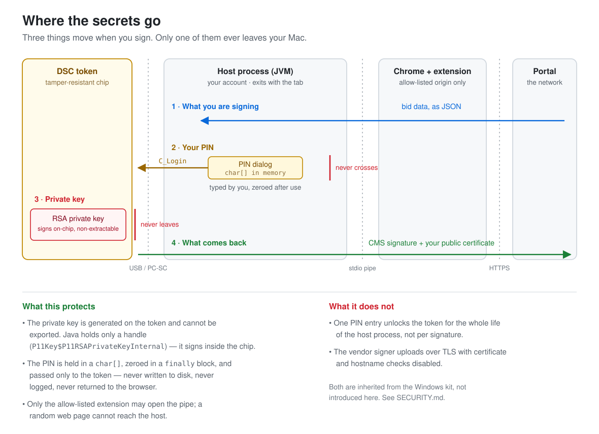

# Security

This host handles a Digital Signature Certificate — a legally binding signing
key. This document states what it protects, what it does not, and how to obtain
the vendor binaries without making a supply-chain mistake.

Everything below was verified on the actual artefacts; the commands to
re-verify it yourself are included, and you should run them rather than take
my word for it.



### Two vendors, and they are not the same party

This document names both, because a finding against one is not a finding
against the other:

| | Who | What they supply |
|---|---|---|
| **The signer** | **[DXC Technology](https://www.dxc.com/)** | `eSigner.jar`, and the browser extension the portal serves. Every class outside the bundled libraries is under `com.dxc.eproc.pki`, and its `Main-Class` is `com.dxc.eproc.pki.EprocSigner`. |
| **The token driver** | **Feitian Technologies** (sold in India as Hypersecu / HYPERPKI) | `libcastle_v2.1.0.0.dylib`, the PKCS#11 module that talks to the HYP2003 token. |

§3.2 below is about **DXC's** code. §4 is about obtaining **Feitian's** module
safely. Where the word "vendor" appears unqualified elsewhere, it means whichever
of the two supplies the file under discussion.

---

## 1. What runs, and with what privileges

| | |
|---|---|
| Runs as | your user account — never root |
| Started by | Chrome, on demand, when the portal requests a signature |
| Lifetime | exits when the tab closes; nothing runs between signatures |
| Installed to | `~/Library/Application Support/eProcSigner/` only |
| System changes | none — no kext, no launch agent, no login item, no `sudo` |

`make install` writes only inside `$HOME`. You can confirm nothing persistent
was added:

```bash
ls ~/Library/LaunchAgents | grep -i eproc     # expect: no output
launchctl list | grep -i eproc                # expect: no output
```

## 2. What is protected

**The private key never leaves the token.** It was generated on the chip and is
marked non-extractable. Java receives a *handle*, not key material — the
signature is computed inside the token. The tests assert this by printing the
runtime class:

```
key class=sun.security.pkcs11.P11Key$P11RSAPrivateKeyInternal
```

`P11Key…Internal` is the JDK's type for a key it cannot read. If this port had
accidentally pulled the key into memory, that line would name an ordinary
`RSAPrivateKey`.

**The PIN goes to the token and nowhere else.**
[`PinDialog`](src/com/eproc/mac/PinDialog.java) returns a `char[]`;
[`TokenKeyStore.engineLoad`](src/com/eproc/mac/TokenKeyStore.java) passes it
straight to PKCS#11 `C_Login` and zeroes it in a `finally` block. It is never
written to disk, never placed in a log, never put in a `String` (which could not
be wiped), and never returned to the browser.

**A random website cannot reach the host.** The native-messaging manifest names
exactly one permitted caller:

```json
"allowed_origins": [ "chrome-extension://oneboplbahpaldoloieajnbibaeocdlj/" ]
```

Chrome refuses connections from any other extension, and web pages cannot open
the pipe at all — only the extension can, and only from pages it is scoped to.

**The keystore is read-only.** Every mutating operation on `TokenKeyStore`
throws. Nothing here can add, delete or overwrite anything on your token.

## 3. What is *not* protected

Be aware of these. Two are inherited from DXC's signer and exist identically on
Windows; this port neither introduces nor fixes them.

### 3.1 One PIN entry unlocks the token for the whole process

`TokenKeyStore` caches the logged-in keystore in a static field, so the PIN is
requested once per host launch rather than once per signature. That is
deliberate — the signer builds the keystore in two places and double-prompting
is worse — but it means **that while the tab is open, further signature requests
from the portal will not prompt you again.**

To end the session: close the portal tab (the host exits), or unplug the token.

### 3.2 DXC's signer disables TLS verification (inherited)

`eSigner.jar` — [DXC](https://www.dxc.com/)'s own code, used here unmodified —
makes outbound HTTPS calls with Apache HttpClient configured to accept **any**
certificate from **any** host:

```
$ javap -p -c com/dxc/eproc/pki/EprocSigner.class | grep -c NoopHostnameVerifier
5
$ javap -p -c com/dxc/eproc/pki/EprocSigner.class | \
      awk '/lambda\$callPostHttp\$4/,/^$/'
  private static boolean lambda$callPostHttp$4(X509Certificate[], String) …
    Code:
         0: iconst_1        <- returns true unconditionally
         1: ireturn
```

That lambda is the `TrustStrategy` handed to `SSLContextBuilder.loadTrustMaterial`.
Returning `true` means every server certificate is trusted; `NoopHostnameVerifier`
means the hostname is not checked either. The destination URLs arrive in the
JSON message (`url`, `signStoreUrl`, `continueToSignUrl`), so they are chosen by
the caller, not hardcoded.

**Practical consequence:** anything the signer uploads — the signature, the
certificate, bid payloads, the AES key material it exchanges — travels over a
TLS channel that authenticates nothing. Someone able to intercept your traffic
(hostile Wi-Fi, a malicious proxy, DNS tampering) could read or alter it.

**It does not expose your private key or PIN** — those never enter this path.

**What to do:** sign from a network you trust. Avoid public Wi-Fi. If you have a
channel to the portal operator, this is worth reporting to them; it is a defect
in the shipped Windows product, not something a macOS port can repair.

### 3.3 The PKCS#11 module is native code in your process

Feitian's `.dylib` is loaded into the JVM and, by construction, sees your PIN —
that is how `C_Login` works. A tampered module could capture it. This is
inherent to PKCS#11 on every platform, and it is precisely why §4 matters.

### 3.4 Anything with your user account can watch this

A process already running as you could attach a debugger or log keystrokes. This
host does not defend against a compromised account; nothing at this layer can.

### 3.5 Wrong PINs lock the token permanently

A DSC token has a small retry counter. Exhaust it and the certificate is dead —
you re-apply and re-pay. Nothing in this repo ever guesses, stores, retries or
brute-forces a PIN, and `make test` uses a software token specifically so that
development spends no attempts.

## 4. Getting the vendor binaries safely

This repository ships **no** third-party binaries. You supply two, and *how* you
obtain them is the most security-sensitive step in the whole process — a
malicious PKCS#11 module would see your PIN (§3.3).

### Do not search for the driver

Do not put "HYP2003 driver download" into a search engine and click a result.
Driver-download aggregators, SEO clones and "driver pack" sites are a standard
malware delivery route, and they rank well precisely because people do this.

### Trace a chain from something you already trust

Follow a path where each step is authenticated by the previous one:

**The PKCS#11 module**

1. Start from the physical token or your DSC paperwork — it names the issuing
   Certifying Authority (Capricorn, eMudhra, Sify, nCode…).
2. Go to *that CA's* official site, reached by typing the domain or from the
   Controller of Certifying Authorities' list at
   [cca.gov.in](https://cca.gov.in/licensed_ca.html) — a government source that
   is authoritative about which CAs exist.
3. Use the driver link on the CA's own support page, or type
   `hypersecu.com` by hand and navigate Support → Downloads.
4. **Then verify the signature anyway** — see below. A link can be wrong even
   when every step looked right.

**The eSigner kit**

Only from the eProcurement portal you actually log into, over HTTPS, from the
authenticated Downloads section. Never from a mirror or a forum attachment.

### Verify what you downloaded

This is the step that does not depend on trusting anyone's link. Apple's
notarization and Developer ID chain are checkable offline:

```bash
pkgutil --check-signature /Volumes/HYP2003-India/HYP2003-India_*.pkg
```

Expect exactly this issuer, and refuse anything else:

```
Status: signed by a developer certificate issued by Apple for distribution
Notarization: trusted by the Apple notary service
Certificate Chain:
 1. Developer ID Installer: FEITIAN Technologies Co.,Ltd. (S47T4UESP3)
 2. Developer ID Certification Authority
 3. Apple Root CA
```

> **Why does it say FEITIAN and not Hypersecu?** The HYP2003 is a rebadged
> Feitian ePass2003; Hypersecu distributes it. FEITIAN signing it is correct and
> expected. A signature naming any *third* party is not — stop there.

`make verify-deps` runs the equivalent check on the extracted module and
compares against the exact build this repo was tested with:

```
module    lib/libcastle_v2.1.0.0.dylib
authority Developer ID Application: FEITIAN Technologies Co.,Ltd.
team id   S47T4UESP3                      (expected S47T4UESP3)
sha256    3e7b9e91…59cf9c                 (matches the tested build)
```

Pinned SHA-256 of what was tested here:

| File | SHA-256 |
|---|---|
| `libcastle_v2.1.0.0.dylib` | `3e7b9e91a861fccbafa9e992daa4c3c4746d9a20eb99e2f43ac860037159cf9c` |
| `eSigner.jar` (v1.9) | `819d940493ea3f550a8d93f5b17b768bb8b41895a9e649e2c2fb3d982baeaccd` |

A hash mismatch is **not** proof of compromise — vendors ship new builds — but
it does mean you are running something this repo has never seen. The code
signature is the durable check; the hash only tells you whether your bits are
identical to mine.

`eSigner.jar` is not code-signed at all, so for it the portal's HTTPS session
and the hash above are what you have.

## 5. What this repository does not do

Verifiable by reading `src/` — about 700 lines:

- No network access of its own. The shim opens no sockets; it speaks stdin and
  stdout to Chrome and PKCS#11 to the token.
- No telemetry, analytics or crash reporting.
- No credential storage. `esigner.properties` holds a Java path and a library
  path — nothing secret. Logs record request metadata, never the PIN.
- No modification of `eSigner.jar`. It is loaded as shipped. The two classes in
  `src/com/dxc/eproc/pki/` are classpath shadows that redirect a hardcoded
  Windows log path; they are not patches to the jar.
- No privilege escalation, and no `curl | sh`.

## 6. Auditing it yourself

```bash
# What does the shim actually do?
wc -l src/**/*.java && $EDITOR src/com/eproc/mac/TokenKeyStore.java

# Does the host open any network connection while signing?
sudo lsof -nP -p $(pgrep -f com.eproc.mac.Launcher) | grep -i tcp

# What does DXC's signer do? (needs the jar extracted)
javap -p -c com/dxc/eproc/pki/EprocSigner.class | less

# Prove the key is non-extractable
make test-token          # look for the key class line
```

## 7. Reporting

Security issues in **this repository**: open a GitHub issue, or a private
advisory via the Security tab if you would rather not disclose publicly.

Issues in `eSigner.jar` or the portal — including §3.2 — belong to the portal
operator (DXC / the state eProcurement authority). Issues in the PKCS#11 module
belong to Feitian/Hypersecu. I can't fix either, and neither can this port.

## 8. Scope of testing

This was verified on exactly one configuration — see *Tested on* in the
[README](README.md#tested-on). The security properties in §2 follow from the
code and hold anywhere, but the *evidence* comes from one Mac, one token and one
portal. Treat any other combination as unverified until you run `make test-token`
on it yourself.
