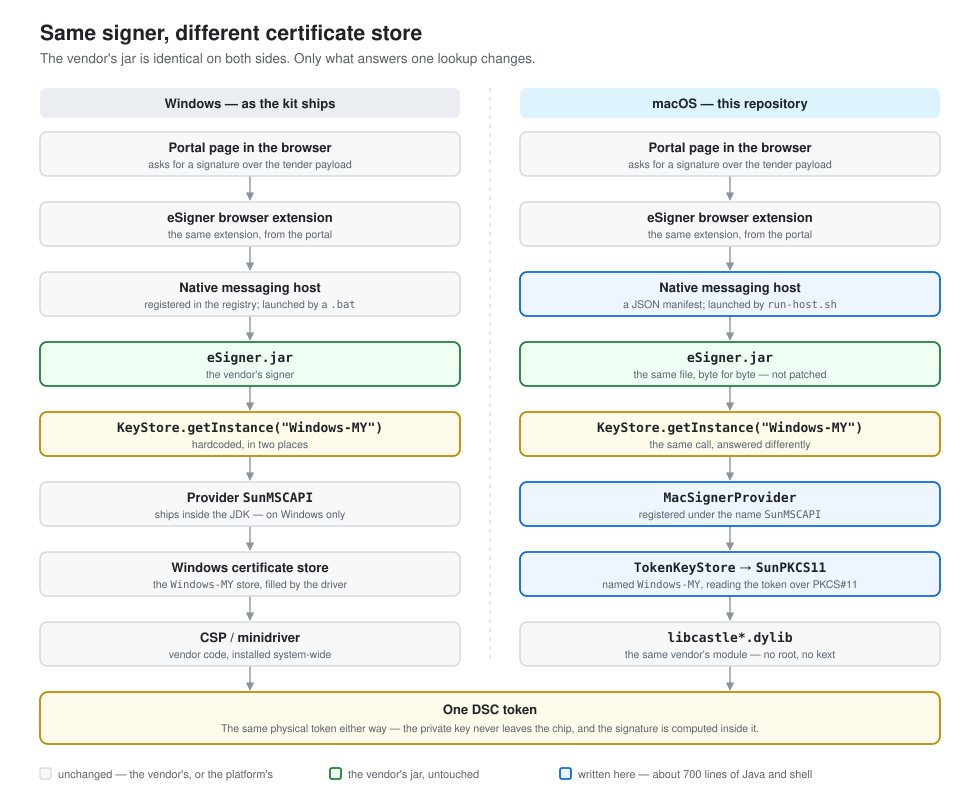

# eProcurement eSigner — macOS host

Runs the Karnataka eProcurement signer (`eSigner.jar` v1.9) on macOS.
`eSigner.jar` itself is **not modified**.

## Why the stock kit can't work here

`eproc-native-installer.jar` unpacks `eProcSigner.zip` into
`%USERPROFILE%\AppData\Local\eProcSigner\` and runs `install_host.bat`, which
writes `HKCU\Software\Google\Chrome\NativeMessagingHosts\com.dxc.eproc.pki`.
Nothing in that path exists on macOS, and the archive contains no Mac binary.

The signer underneath is portable Java, but it reaches certificates through
Windows' certificate store, in two hardcoded places:

| Class | Call |
|---|---|
| `KeyStoreUtils.getMSKeyStore()` | `KeyStore.getInstance("Windows-MY")` |
| `CertificatePanel.updateCertificateTable()` | `KeyStore.getInstance("Windows-MY", "SunMSCAPI")` |

`SunMSCAPI` ships only on Windows, so both throw `KeyStoreException:
Windows-MY not found`. (`KeyStoreUtils.getPKCS11Store()` exists but is dead
code, and is broken anyway — it writes its generated config over the driver
library's own path and passes a null provider.)

## How this works



Instead of patching two decompiled classes, this registers a JCE provider
**named `SunMSCAPI`** that offers a KeyStore **named `Windows-MY`**, backed by
the DSC token over PKCS#11. Both call sites then succeed unchanged.

`SignatureGenerator` signs via BouncyCastle using
`keyStore.getProvider().getName()` — which is now `"SunMSCAPI"` — so the
provider forwards everything that isn't `Windows-MY` (Signature, MessageDigest)
to the real `SunPKCS11` provider. The private key stays on the token.

```
Chrome extension
   │  native messaging (stdio)
   ▼
run-host.sh ──> java -cp esigner-mac.jar:eSigner.jar com.eproc.mac.Launcher
                            │
                            ├─ registers MacSignerProvider ("SunMSCAPI")
                            │     └─ KeyStore "Windows-MY" ──> TokenKeyStore
                            │            └─ SunPKCS11 ──> libcastle*.dylib ──> HYP2003
                            └─ com.dxc.eproc.pki.EprocSigner.main()  (stock jar)
```

`Logger` and `Debug` are also shadowed (classpath order), only to redirect
their hardcoded `AppData\Local\...` log path to `~/Library/Logs/eProcSigner/`.

## Source layout

| Path | Role |
|---|---|
| `src/com/eproc/mac/MacSignerProvider.java` | The provider named `SunMSCAPI`; delegates non-keystore lookups |
| `src/com/eproc/mac/TokenKeyStore.java` | `KeyStoreSpi` over PKCS#11; caches the unlocked store so the PIN is asked once |
| `src/com/eproc/mac/Config.java` | Finds the PKCS#11 module and reads `esigner.properties` |
| `src/com/eproc/mac/PinDialog.java` | Swing PIN prompt; honours `$ESIGNER_PIN` for tests |
| `src/com/eproc/mac/Launcher.java` | Registers the provider, then calls the stock `EprocSigner.main` |
| `src/com/dxc/eproc/pki/{Logger,Debug,MacLog}.java` | Classpath shadows; log-path redirect only |
| `bootstrap.sh` | Extracts `eSigner.jar` and the PKCS#11 module from vendor packages |
| `Makefile` | Entry point; owns the compile dependency graph |
| `scripts/install-host.sh` / `uninstall-host.sh` | Deploy to `~/Library/Application Support/eProcSigner/`, write browser manifests |
| `scripts/status.sh` | Post-install health check (`make status`) |
| `scripts/verify-deps.sh` | Vendor binary code-signature and hash check (`make verify-deps`) |
| `test/CertDiagnostic.java` | Per-certificate key-usage report and signing attempt (`make diagnose`) |
| `run-host.sh` | What Chrome execs |

The two shadowed `com.dxc.eproc.pki` classes are the only place this repo takes
a name inside the vendor's package. They are ordinary reimplementations of two
tiny logging classes, placed earlier on the classpath; `eSigner.jar` is never
opened or rewritten.

## The PKCS#11 module

Hypersecu's module is a universal binary that links against nothing but Apple's
own frameworks —

```
CoreFoundation, IOKit, libSystem, libc++, PCSC.framework
```

— no kext, no launch daemon, no `tokend`. So `bootstrap.sh` lifts it straight
out of the `pkcs11.pkg` payload and `make install` drops it beside the jars, which
is why nothing here needs root. `make uninstall` takes it away again.

Running the vendor installer instead works and takes precedence: if
`/usr/local/lib/libcastle*.dylib` exists, `make install` prefers it. That package
also registers a CryptoTokenKit extension (`HYPSmartTokenExt.appex`) which
surfaces the certificates in Keychain for Safari — pleasant, but no use here,
since Java's `KeychainStore` provider requires exportable private keys and a
token key by definition is not exportable.

## Configuration

`~/Library/Application Support/eProcSigner/esigner.properties`:

| Key | Meaning |
|---|---|
| `java.bin` | Absolute path to `java` (Chrome gives the host almost no PATH) |
| `pkcs11.library` | Path to the PKCS#11 module |
| `pkcs11.slotListIndex` | Set if the token isn't on the first slot |
| `arch=x86_64` | Run the JVM under Rosetta (set automatically if the driver is Intel-only) |

## Verified

On macOS 26.5.1 / Apple Silicon with OpenJDK 26, against a Hypersecu HYP2003
token holding Capricorn-issued DSCs:

- Token detected as a CCID reader by macOS's built-in driver, with no vendor
  software installed: `HYPERSECU USB TOKEN`, ATR `3b9f958131fe9f00…`.
- **Real HYP2003 token, full chain** — `test/run-token-test.sh` → ALL CHECKS
  PASSED. Three DSCs enumerated through the stock `KeyStoreUtils`, key handle
  `sun.security.pkcs11.P11Key$P11RSAPrivateKeyInternal` (non-extractable), and a
  2488-byte CMS SignedData from the stock `SignatureGenerator` that verifies
  against its own signer certificate.
- Same test against a SoftHSM software token, for a driver-free regression:
  `test/run-smoke-test.sh` → ALL CHECKS PASSED.
- Deployed host answers Chrome's protocol:
  `{"appletMode":"CHECK_API"}` → `{"hasNative":true,"appVersion":"1.9"}`.

## Notes

- **OpenSC cannot serve this token, and isn't needed.** It reaches the card
  fine — `card-epass2003.c` handles the ATR and secure messaging negotiates —
  but the token is initialised in Feitian's EnterSafe minidriver layout
  (`mscp`, `cmapfile`, `containermap`) rather than PKCS#15. There is no
  `3f00/5015` DF for OpenSC's PKCS#15 layer to bind to, so `pkcs15-tool`
  reports `Unsupported card`. Writing an OpenSC emulator for that layout is
  possible in principle (PIV, CAC and others have exactly such emulators) but
  means reversing an undocumented container format against a live token, with
  the PIN retry counter as the failure mode. The vendor module is 3.7 MB, self
  contained, and works.
- macOS is "driverless" only at the transport layer: the CCID reader class is
  handled natively, but the only card driver Apple ships is `pivtoken.appex`,
  and this card is not PIV. That is why the reader appears while nothing can
  read keys off it until a PKCS#11 module is supplied.
- `make install` sets `arch=x86_64` if the module turns out to be Intel-only, in
  which case an Intel JDK is needed. Not the case for
  `libcastle_v2.1.0.0.dylib`, which is universal.
- The portal receives `osName`/`osArch` from the host. If the server-side
  rejects non-Windows clients, no amount of local work changes that — it would
  have to be raised with KPPP support.
